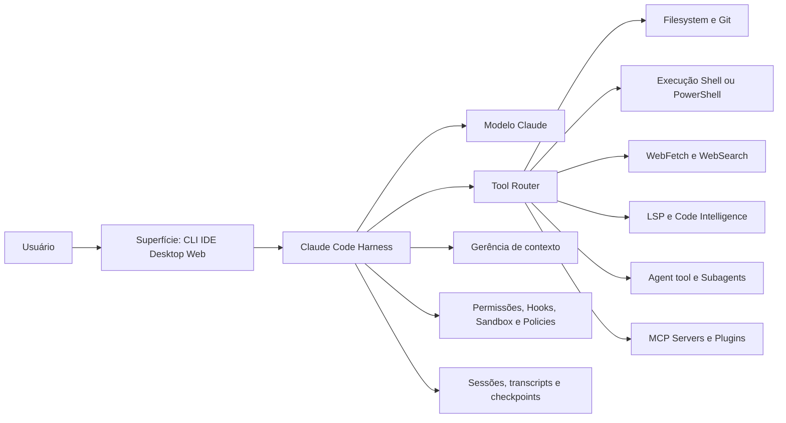
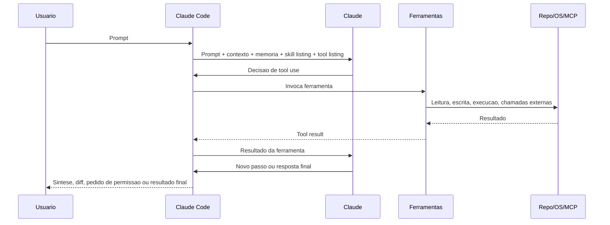

# Arquitetura central do Claude Code

Este documento descreve o Claude Code como sistema: não apenas como CLI, mas como harness agentic em torno do modelo Claude.

Leitura recomendada em paralelo:

- [Instalação, setup e operação](../02-instalacao-operacao/README.md)
- [MCP e ecossistema de ferramentas](../03-mcp/README.md)
- [Subagents](../05-subagents/README.md)
- [Hooks](../06-hooks/README.md)
- [Skills, plugins e extensibilidade](../07-skills-e-plugins/README.md)

## 1. Definição arquitetural

[Oficial] A documentação do produto define o Claude Code como uma ferramenta agentic de engenharia que lê o codebase, edita arquivos, executa comandos, consulta a web e integra ferramentas de desenvolvimento em terminal, IDE, desktop e browser.

A forma mais útil de pensar o produto é esta:

- o modelo Claude faz raciocínio
- o Claude Code fornece o harness de agência
- as ferramentas convertem raciocínio em ação observável
- o sistema de contexto limita o que o agente consegue lembrar e carregar
- permissões, hooks, sandbox e políticas definem o envelope de segurança

## 2. Visão de sistema

## 3. O loop agentic central

[Oficial] O loop básico é descrito em três fases:

1. gather context
2. take action
3. verify results

Esse loop não é linear. Ele é recursivo e adaptativo. O agente pode ler arquivos, executar um comando, descobrir um erro, voltar a pesquisar, editar novamente e rerodar validação até convergir.

### Relação entre modelo e harness

[Oficial] Quando a documentação diz que “Claude decide”, quem decide é o modelo. Quando a decisão vira leitura de arquivo, tool call, diff, checkpoint, prompt de permissão ou reconexão de MCP, quem operacionaliza isso é o harness do Claude Code.

Isso é importante porque muitos tradeoffs não são “problema do modelo”, e sim do harness:

- quais ferramentas existem
- quanto do contexto é visível em cada turno
- como tool outputs são comprimidos
- quando pedir permissão
- como reexecutar ou reconectar
- como isolar subtarefas

## 4. Componentes arquiteturais principais

### 4.1 Modelo

[Oficial] O Claude Code suporta aliases como `sonnet`, `opus`, `haiku`, variantes com contexto de 1M e o alias `opusplan`, que usa Opus em plan mode e Sonnet na execução.

Responsabilidades do modelo:

- interpretar o pedido
- decidir quando pesquisar, editar, delegar ou validar
- escolher a sequência de ferramentas
- sintetizar resultados
- adaptar a estratégia conforme feedback do ambiente

### 4.2 Tooling layer

[Oficial] A camada de ferramentas embutidas cobre pelo menos:

- leitura e escrita de arquivos
- busca por nome e por conteúdo
- shell e PowerShell
- web fetch e web search
- code intelligence via LSP
- subagents e task management
- cron e rotinas de sessão
- integrações com MCP

Essa camada é o que torna o produto verdadeiramente agentic. Sem ela, Claude responderia em texto; com ela, Claude interage com o repositório e o ambiente.

### 4.3 Gerência de contexto

[Oficial] O contexto inclui:

- histórico da conversa
- arquivos lidos
- saídas de ferramentas
- `CLAUDE.md`
- auto memory
- skills carregadas
- instruções de sistema

Quando o contexto enche, o Claude Code compacta automaticamente. Primeiro remove outputs antigos de ferramentas; depois resume a conversa. Regras persistentes devem sair da conversa e ir para `CLAUDE.md` ou para skills, porque instruções antigas podem se perder durante compaction.

### 4.4 Sessões e estado local

[Oficial] A sessão salva mensagens, tool uses e resultados em JSONL sob `~/.claude/projects/`. Antes de editar arquivos, o sistema registra checkpoints locais para rewind.

Isso dá ao produto três propriedades arquiteturais importantes:

- continuidade de sessão por diretório/worktree
- reversibilidade de edição independente de Git
- observabilidade local do raciocínio operacional

### 4.5 Controles de segurança

[Oficial] O envelope de segurança combina mecanismos diferentes:

- permission modes
- regras `allow`, `ask` e `deny`
- hooks `PreToolUse` e correlatos
- sandbox de shell
- políticas gerenciadas
- restrição de MCP, plugins e domínios de rede

Esses mecanismos são complementares, não substitutos. Exemplo: negar `WebFetch` não impede `curl` se Bash continuar permitido; para esse caso, sandbox e deny rules de Bash precisam existir.

## 5. Interfaces e ambientes de execução

[Oficial] O loop do agente é conceitualmente o mesmo em todas as superfícies, mas o local de execução muda.

| Ambiente | Onde o código roda | Uso dominante |
| --- | --- | --- |
| Local | Sua máquina | Desenvolvimento diário, acesso total ao repo e toolchain |
| Cloud | Infra gerenciada pela Anthropic | Offload, web sessions, routines, ultrareview, ultraplan |
| Remote Control | Sua máquina controlada pelo browser | Continuidade remota sem mover o ambiente |

As interfaces mais importantes são:

- CLI
- VS Code
- JetBrains
- Desktop
- Claude Code on the web
- Slack
- CI/CD

O que muda entre elas é a UX, o meio de aprovação e algumas capacidades auxiliares. O núcleo do loop agentic continua o mesmo.

## 6. Planejamento, execução, validação e síntese

Uma leitura arquitetural fiel do produto é tratá-lo como um pipeline adaptativo de quatro funções:

### Planejamento

- análise do pedido
- escolha de modelo, effort e ferramentas
- entrada em plan mode quando necessário
- possível uso de Explore ou Plan subagent

### Execução

- leitura de arquivos
- edição de código
- execução de shell/PowerShell
- chamadas MCP
- delegação para subagents ou teammates

### Validação

- rerun de testes e builds
- type errors via LSP
- hooks de compliance e lint
- observação de CI, logs ou eventos externos

### Síntese

- resumo das mudanças
- próximos passos
- resultados de subtarefas
- compaction e recap de sessões

Essa separação é valiosa porque cada mecanismo de extensibilidade pluga em uma fase diferente:

- `CLAUDE.md` altera planejamento e execução
- skills alteram planejamento e execução sob demanda
- hooks interceptam execução e validação
- MCP amplia execução e acesso a dados
- subagents alteram estratégia de execução e síntese

## 7. Fluxo de controle resumido

## 8. Princípios arquiteturais observáveis

### 8.1 Contexto é recurso escasso

[Oficial + inferência] Em Claude Code, custo, qualidade e estabilidade convergem para o uso de contexto. Skills on-demand, tool search para MCP e subagents isolados existem principalmente para controlar esse recurso.

### 8.2 O produto assume um mundo tool-rich

[Oficial] O design favorece a expansão do runtime com MCP, plugins, code intelligence e hooks. A arquitetura não trata extensões como acessório; elas são parte do caminho principal de evolução do produto.

### 8.3 Delegação é parte do núcleo, não um add-on

[Oficial] Subagents são ferramenta nativa; Agent View, Agent Teams e background agents expandem a mesma ideia. O produto está se movendo de “um agente” para “uma malha de agentes coordenados”.

### 8.4 Segurança é policamada

[Oficial] O produto não assume um único boundary de segurança. Permissão, policy, sandbox, hooks, allowlists de MCP e controles de domínio se combinam em camadas.

## 9. Limitações arquiteturais importantes

- [Oficial] detalhes de heurística interna para auto delegation, compaction e auto mode classifier não são especificados como contrato estável
- [Oficial] recursos experimentais como Agent Teams, Auto Mode, Computer Use CLI, Routines e Channels podem mudar de API e comportamento
- [Oficial] a superfície funcional varia por plano e provider, então não existe “Claude Code” único para todos os ambientes
- [Inferência] repos muito grandes ou com outputs extremamente verbosos forçam desenho disciplinado de contexto, caso contrário o agente degrada rápido

## 10. Leitura arquitetural prática

Se você estiver modelando Claude Code para adoção em produção, pense em cinco perguntas:

1. Onde o agente vai executar: local, cloud ou remote-control?
2. Que contexto deve ser sempre carregado e o que deve ser on-demand?
3. Que ações precisam de enforcement determinístico por hooks ou policies?
4. O acesso externo deve ocorrer por CLI, MCP, plugin ou rotina cloud?
5. Quando usar subagents e quando o problema já pede agent teams ou worktrees?

As respostas a essas perguntas praticamente definem a arquitetura de adoção.