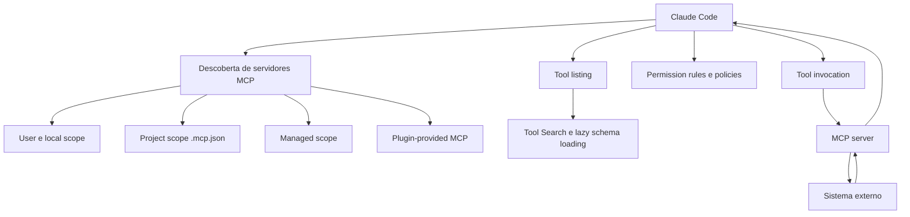

# MCP e ecossistema de ferramentas

Este documento trata do Model Context Protocol como mecanismo de extensão do Claude Code e da forma como o produto descobre, conecta, carrega, protege e opera ferramentas externas.

Leitura complementar:

- [Arquitetura central](../01-arquitetura-central/README.md)
- [Hooks](../06-hooks/README.md)
- [Skills, plugins e extensibilidade](../07-skills-e-plugins/README.md)

## 1. Papel do MCP na arquitetura do Claude Code

[Oficial] O MCP é o protocolo aberto usado pelo Claude Code para conectar ferramentas, serviços, dados e conectores externos ao agente.

No desenho do produto, MCP resolve um problema específico: expandir o espaço de ação do agente sem transformar cada integração em funcionalidade nativa do CLI.

Exemplos de uso oficiais:

- issue trackers
- monitoramento e analytics
- bancos de dados
- design tools
- automações de e-mail ou chat
- browser control
- canais que empurram eventos para uma sessão viva

## 2. Visão arquitetural



## 3. Como o Claude Code descobre e conecta servidores MCP

### 3.1 Fontes de configuração

[Oficial] MCP pode chegar ao runtime por:

- configuração local ou user em `~/.claude.json`
- configuração compartilhada do projeto em `.mcp.json`
- políticas gerenciadas
- plugins que embutem `.mcp.json` ou definições inline
- definição inline em subagents

### 3.2 Escopos e precedência

[Oficial] A precedência operacional de servidores com o mesmo nome é:

- local
- project
- user

Em cenários enterprise, allowlists e denylists gerenciados podem reduzir ainda mais esse espaço de configuração.

### 3.3 Transporte

[Oficial] O produto suporta três caminhos principais documentados:

- HTTP, recomendado para servidores remotos
- SSE, legado e explicitamente desaconselhado quando houver HTTP
- stdio, para processos locais

Na documentação de subagents e plugins também aparecem esquemas inline compatíveis com `stdio`, `http`, `sse` e `ws`, mas o caminho principal documentado para uso geral é HTTP/stdio.

## 4. Instalação e gestão de servidores

### 4.1 HTTP remoto

```bash
claude mcp add --transport http notion https://mcp.notion.com/mcp
```

### 4.2 SSE remoto

```bash
claude mcp add --transport sse asana https://mcp.asana.com/sse
```

### 4.3 Stdio local

```bash
claude mcp add --transport stdio airtable -- npx -y airtable-mcp-server
```

### 4.4 Gestão de ciclo de vida

[Oficial] O CLI expõe comandos operacionais claros:

- `claude mcp list`
- `claude mcp get <name>`
- `claude mcp remove <name>`
- `/mcp` dentro da sessão para status, autenticação OAuth e inspeção de custo/falha

## 5. Tool loading, schemas e Tool Search

Um dos aspectos mais importantes do Claude Code moderno é que MCP não precisa inflar o contexto desde o início.

[Oficial] O comportamento padrão documentado é:

- nomes de ferramentas entram no contexto no início da sessão
- schemas completos podem ser carregados sob demanda
- ToolSearch pode descobrir e carregar apenas o necessário em ecossistemas com muitas tools

### Por que isso importa

- reduz custo de contexto
- melhora escalabilidade para muitos conectores
- evita poluir o prompt com centenas de schemas irrelevantes

### Implicação arquitetural

[Inferência arquitetural] Tool Search transforma MCP de “catálogo estático de ferramentas” em “mercado lazy de capacidades”. Em repos e organizações com muitos servidores, isso é a diferença entre uma arquitetura viável e uma superfície que se autossabota por contexto.

## 6. Contratos, segurança e isolamento

## 6.1 Trust boundary

[Oficial] O Claude Code recomenda validar se você confia em cada servidor MCP antes de conectá-lo. Servidores que buscam conteúdo externo podem introduzir prompt injection ou caminhos de exfiltração.

## 6.2 Políticas gerenciadas

[Oficial] Os seguintes controles são particularmente importantes:

- `allowedMcpServers`
- `deniedMcpServers`
- `allowManagedMcpServersOnly`
- `disabledMcpjsonServers`
- `enabledMcpjsonServers`

## 6.3 OAuth e autenticação

[Oficial] O `/mcp` é a superfície operacional para autenticar servidores remotos que usam OAuth 2.0.

## 6.4 Ambiente de execução

[Oficial] Em servidores stdio, o processo recebe `CLAUDE_PROJECT_DIR`, permitindo resolver paths de forma estável. Esse detalhe é valioso para desenhar servidores capazes de operar corretamente sem depender do cwd incidental.

## 6.5 Risco de output excessivo

[Oficial] Resultados de ferramentas MCP têm limite de saída e geram warning quando excedem 10.000 tokens. Há também `MAX_MCP_OUTPUT_TOKENS`, além de suporte a limites por ferramenta em releases recentes.

## 7. Robustez operacional

[Oficial] O produto implementa mecanismos importantes de confiabilidade:

- reconexão automática para HTTP/SSE com backoff exponencial
- retry de conexão inicial para erros transitórios
- indicação de estado pendente/falho em `/mcp`
- suporte a `list_changed` para atualização dinâmica de tools

### Ponto importante

Servidores stdio não têm a mesma semântica de reconexão automática de remotos. Se o processo local morrer, a estratégia de recuperação é diferente e geralmente mais operacional do que protocolar.

## 8. Channels: MCP como entrada de eventos

[Oficial] Channels são uma extensão de MCP em research preview onde um servidor pode empurrar mensagens para uma sessão viva do Claude Code.

Isso muda a arquitetura do agente de polling para event-driven.

Casos de uso:

- alertas de monitoramento
- eventos de CI
- bridges de chat
- notificações de webhook

### Restrições relevantes

- exigem autenticação Anthropic-first ou Console API key
- não estão disponíveis em Bedrock, Vertex ou Foundry
- em Team/Enterprise precisam ser explicitamente habilitados

## 9. Padrões de desenho recomendados

### 9.1 Skill + MCP

Use MCP para acesso e skill para ensinar como usar o acesso.

Exemplo:

- MCP expõe banco de dados
- skill documenta schema, consultas seguras e semântica de negócio

### 9.2 Servidor fino e especializado

Prefira servidores com responsabilidade clara em vez de um megaservidor genérico de tudo. Isso facilita governança, permissão e troubleshooting.

### 9.3 Tool Search por padrão em superfícies grandes

Em ecossistemas com dezenas ou centenas de tools, trate Tool Search como default arquitetural, não otimização posterior.

### 9.4 Plugin como pacote de integração

Quando uma integração precisa ser distribuída para times, empacote skill + hooks + MCP server em plugin, em vez de exigir setup artesanal em cada repo.

### 9.5 Inline MCP para subagents especializados

Se uma integração só interessa a um worker especializado, defina o servidor inline no subagent para evitar custo de contexto e exposição desnecessária ao agente principal.

## 10. Anti-patterns comuns

- conectar servidores MCP “porque parecem úteis”, sem policy, sem owner e sem uso recorrente
- usar MCP para tarefas que CLI nativo resolve com menos contexto
- expor ferramentas de escrita de alto impacto sem hooks, sem permission rules e sem sandboxing ao redor
- deixar servidores herdarem ambiente inteiro quando basta um subconjunto de variáveis
- assumir que toda feature MCP está igualmente disponível em todos os providers

## 11. Limitações e lacunas

- [Oficial] recursos Anthropic-first como Channels não têm paridade nos providers third-party
- [Oficial] proxies/gateways customizados podem exigir ajustes para Tool Search e `tool_reference`
- [Lacuna] a documentação explica contratos e comportamento, mas não detalha completamente heurísticas de seleção de ferramenta em cenários com muitas tools parecidas

## 12. Leitura prática

Se você estiver desenhando um ecossistema MCP para Claude Code, a sequência correta tende a ser:

1. modelar trust boundary
2. escolher transporte por caso de uso
3. minimizar escopo e output das ferramentas
4. adicionar Tool Search
5. ensinar uso com skills ou docs operacionais
6. governar com permissions, hooks e managed settings

Esse é o caminho que separa uma integração utilizável de um runtime caótico.