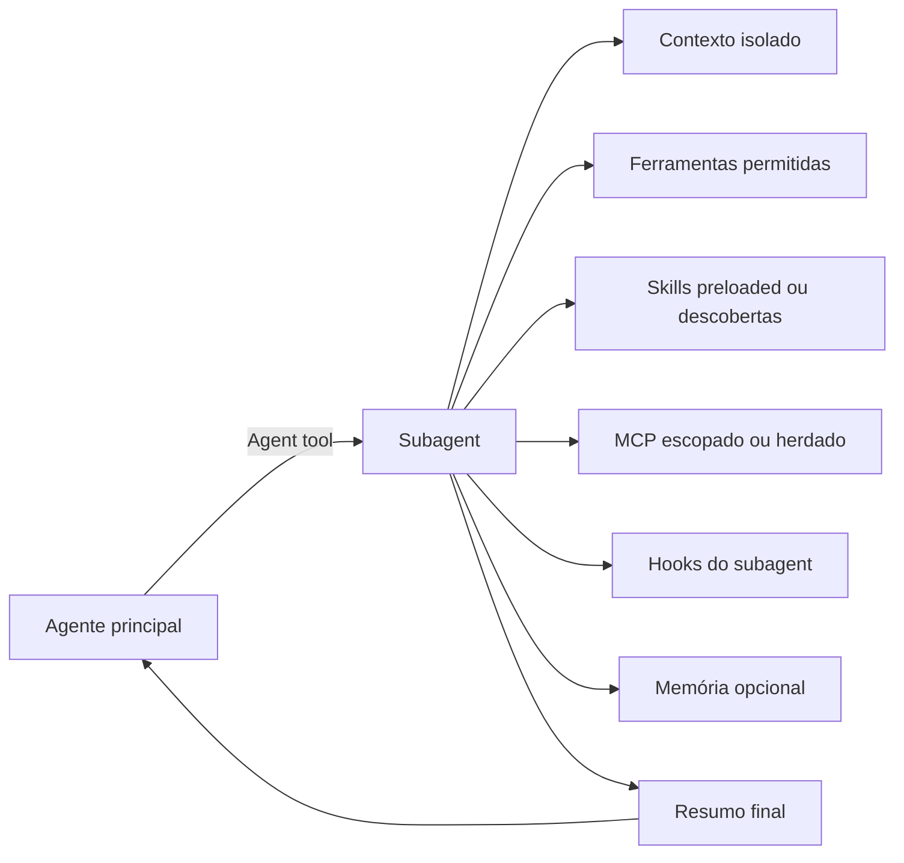

# Subagents

Subagents são o mecanismo nativo de delegação do Claude Code. Eles são o ponto em que o produto deixa de ser um único agente monolítico e passa a operar com workers especializados, isolados e, em muitos casos, paralelizáveis.

Documentos relacionados:

- [Arquitetura central](../01-arquitetura-central/README.md)
- [Hooks](../06-hooks/README.md)
- [Skills, plugins e extensibilidade](../07-skills-e-plugins/README.md)
- [Padrões arquiteturais e casos reais](../09-padroes-e-casos/README.md)
- [Análise externa e configurações comunitárias](../11-analise-externa-e-configs-comunitarias/README.md)
- [Configuração avançada de subagents](./configuracao-avancada.md)
- [Ferramentas novas e configuração](./ferramentas-novas-e-configuracao.md)

## 1. O que é um subagent

[Oficial] Um subagent é um assistente especializado com:

- contexto próprio
- system prompt próprio
- conjunto de ferramentas próprio
- modelo próprio ou herdado
- permissões próprias, respeitando herança e precedência

O objetivo principal é isolar trabalho lateral para que a conversa principal receba apenas síntese útil, não o rastro inteiro de exploração.

## 2. Por que subagents existem

[Oficial] O caso clássico é este: uma subtarefa exigiria muita leitura, grep, logs, resultados de teste ou exploração de arquivos que não precisam permanecer no contexto principal.

Subagents resolvem isso por:

- isolamento de contexto
- especialização de comportamento
- redução de custo e ruído cognitivo
- paralelismo controlado

## 3. Arquitetura de delegação

## 4. Ciclo de vida

[Oficial] O ciclo de vida típico é:

1. o agente principal decide delegar
2. o subagent nasce com prompt, tools, model e settings efetivos
3. executa seu próprio loop agentic em contexto separado
4. se necessário, pede permissões conforme o modo efetivo
5. encerra e devolve apenas um texto-resumo ou artefato resumido

Subagents podem disparar hooks próprios e também gerar eventos `SubagentStart` e `SubagentStop` observáveis pela sessão principal.

## 5. Tipos built-in

[Oficial] O Claude Code inclui pelo menos estes tipos built-in:

| Tipo | Modelo | Papel |
| --- | --- | --- |
| `Explore` | Haiku | exploração rápida, read-only e barata |
| `Plan` | herda do principal | pesquisa em plan mode, evitando aninhamento infinito |
| `general-purpose` | herda do principal | tarefas multi-step com exploração e ação |

Há também helpers internos como `statusline-setup` e `claude-code-guide`.

## 6. Configuração de subagents

Para uma análise exaustiva de todas as opções de configuração, precedência, efeitos colaterais e combinações avançadas, veja [Configuração avançada de subagents](./configuracao-avancada.md).
Para uma leitura complementar sobre ferramentas novas, menos óbvias ou mais avançadas que podem compor subagents, veja [Ferramentas novas e configuração](./ferramentas-novas-e-configuracao.md).

### 6.1 Campos de frontmatter mais importantes

[Oficial]

| Campo | Papel |
| --- | --- |
| `name` | identificador do agente |
| `description` | instrução de roteamento para o orquestrador |
| `tools` / `disallowedTools` | controle de capacidade |
| `model` | `sonnet`, `opus`, `haiku`, modelo fixo ou `inherit` |
| `permissionMode` | modo de permissão efetivo |
| `maxTurns` | limite de turns agentic |
| `skills` | skills preloaded no startup |
| `mcpServers` | servidores MCP escopados |
| `hooks` | hooks scoped ao agente |
| `memory` | memória persistente `user`, `project` ou `local` |
| `background` | preferir execução em background |
| `effort` | nível de effort próprio |
| `isolation` | `worktree` para isolar o repo |
| `color` | semântica visual na UI |

### 6.2 Escopos e precedência

[Oficial] Um subagent pode vir de:

- managed settings
- `--agents` na linha de comando
- `.claude/agents/`
- `~/.claude/agents/`
- `agents/` de plugin

Prioridade alta vence nomes duplicados. Isso permite override organizacional e testes session-scoped.

## 7. Isolamento e compartilhamento de contexto

### 7.1 Isolamento padrão

[Oficial] O subagent nasce em contexto fresco. Ele não herda o histórico completo da conversa principal. Recebe seu próprio prompt e ambiente mínimo.

Esse é o comportamento que realmente reduz ruído de contexto.

### 7.2 Forked subagents

[Oficial, feature controlada por env var] Com `CLAUDE_CODE_FORK_SUBAGENT=1`, existe um modo em que o subagent herda a conversa do pai. Isso é útil quando a subtarefa depende pesadamente do histórico atual, mas sacrifica a vantagem máxima de isolamento.

### 7.3 Worktree isolation

[Oficial] `isolation: worktree` executa o subagent em cópia isolada do repositório. Isso é especialmente valioso quando há risco de colisão de mudanças, refactors paralelos ou necessidade de branching limpo.

## 8. Ferramentas, permissões e MCP por subagent

## 8.1 Controle de ferramentas

[Oficial] Há dois mecanismos principais:

- `tools`: allowlist explícita
- `disallowedTools`: denylist sobre herança ou allowlist

Padrão recomendado: se a especialização do agente for clara, use allowlist. Denylist tende a ser mais frágil quando o produto ganha novas tools.

## 8.2 Restrição de spawning

[Oficial] Um agente rodando como thread principal com `--agent` pode ser autorizado a spawnar apenas subagents específicos usando sintaxe `Agent(name)` no campo `tools`.

## 8.3 Permission mode efetivo

[Oficial] O subagent pode definir `default`, `acceptEdits`, `auto`, `dontAsk`, `bypassPermissions` ou `plan`, mas há precedência do pai em cenários como `bypassPermissions`, `acceptEdits` e `auto`.

Implicação arquitetural: a sessão principal continua sendo o envelope de confiança dominante.

## 8.4 MCP scoped

[Oficial] O campo `mcpServers` pode:

- referenciar servidores já configurados
- definir servidores inline só para aquele worker

Esse é um recurso muito forte para reduzir custo de contexto e restringir blast radius do acesso externo.

## 9. Skills preloaded e memória persistente

### 9.1 Skills preloaded

[Oficial] O campo `skills` injeta conteúdo completo da skill no contexto do subagent no startup. É diferente de deixar a skill disponível apenas via tool de descoberta.

Use quando o worker precisa chegar já condicionado por material de domínio.

### 9.2 Persistent memory

[Oficial] O campo `memory` cria diretório persistente em escopo `user`, `project` ou `local`, com `MEMORY.md` parcialmente carregado e ferramentas de leitura/escrita habilitadas automaticamente.

Isso transforma o subagent em worker com aprendizado acumulado entre sessões.

## 10. Execução em foreground e background

[Oficial]

- foreground subagents bloqueiam a conversa principal e mostram prompts de permissão
- background subagents seguem concorrentes e auto-negam qualquer tool call que exigisse prompt

Conseqüência direta: background funciona melhor para tarefas bem especificadas e com envelope de permissões já pré-autorizado.

## 11. Estratégias de spawning, handoff e encerramento

### Quando spawnar

Spawn de subagent é ideal quando:

- a subtarefa é exploratória e verbosa
- a subtarefa é paralelizável
- a subtarefa tem especialização clara
- a resposta necessária ao pai é um resumo ou parecer, não todo o rastro

### Quando não spawnar

Evite subagent quando:

- a conversa atual contém contexto fino que o worker precisa continuamente e fork não está habilitado
- a tarefa exige iterações muito frequentes com o usuário
- múltiplos workers vão editar exatamente os mesmos arquivos sem worktree

### Encerramento

[Oficial] O subagent para por conclusão, `maxTurns`, falha ou interrupção explícita. Hooks `Stop`/`SubagentStop` podem validar ou bloquear o encerramento.

## 12. Padrões arquiteturais úteis

### 12.1 Explore then summarize

Use `Explore` para mapear codepaths e retornar achados de alto sinal.

### 12.2 Fan-out de investigação

Dispare múltiplos subagents para autenticação, banco e API, depois sintetize no agente principal.

### 12.3 Reviewer especializado com memória

Crie um `code-reviewer` com `memory: project` para acumular padrões e checagens recorrentes do repositório.

### 12.4 Worker isolado por worktree

Ideal para mudanças maiores, correções simultâneas ou refactors em paralelo.

### 12.5 Skill + subagent

Uma skill pode chamar `context: fork`, ou um subagent pode preloadar skills. Esse acoplamento é excelente para especialistas de domínio.

## 13. Custos, performance e tradeoffs

[Oficial] Subagents usam janelas de contexto separadas. Isso traz dois efeitos:

- mais custo total do que uma sequência linear simples
- menos custo e poluição do contexto principal do que fazer tudo inline

Heurística prática:

- use Haiku para pesquisa barata
- use Sonnet para workers de implementação geral
- use Opus apenas quando a subtarefa justificar o custo cognitivo

## 14. Anti-patterns comuns

- criar subagents genéricos demais, sem descrição discriminativa
- preloadar skills pesadas em todo worker sem necessidade
- deixar tools amplas em agentes que deveriam ser read-only
- usar background para tarefas que dependem de prompt humano no meio
- esquecer que resultados detalhados demais ainda voltam para o contexto principal
- tratar subagent como substituto de agent teams quando workers precisam conversar entre si

## 15. Subagents versus agent teams

| Critério | Subagents | Agent teams |
| --- | --- | --- |
| Contexto | separado, mas subordinado ao pai | totalmente independente por sessão |
| Comunicação | volta ao pai | entre teammates e com lead |
| Custo | menor | maior |
| Melhor uso | tarefa focada e resumível | coordenação distribuída de longo fôlego |

## 16. Recomendação prática

Se você estiver desenhando um workflow de engenharia com Claude Code, trate subagents como o mecanismo padrão para:

- pesquisa local intensa
- validação especializada
- summarization de outputs grandes
- workers de domínio com skill preload

Passe para agent teams apenas quando a colaboração entre workers virar requisito, não conveniência.

## 17. Padrões observados em repositórios comunitários

[Corroborado por múltiplos repositórios públicos, não contrato oficial] A pesquisa adicional em repositórios públicos mostrou que subagents quase nunca aparecem sozinhos. Eles tendem a vir empacotados com uma camada operacional mais ampla.

Padrões mais consistentes:

- `.claude/agents/` normalmente aparece junto com `.claude/commands/`, hooks e settings, indicando que a comunidade trata subagents como uma peça de um kit de operação, não como feature isolada.
- hooks são o complemento mais frequente dos subagents. A prática dominante é reduzir risco de autonomia com guardrails de lifecycle, não apenas com prompt.
- skills aparecem nos templates mais maduros, reforçando a separação funcional entre conhecimento reutilizável e worker especializado.
- repositórios minimalistas de `settings.json` existem e são úteis para endurecer permissões, mas não substituem uma arquitetura de delegação bem desenhada.

O que apareceu menos do que a documentação oficial sugeriria:

- `isolation: worktree`
- `mcpServers` escopados por agente
- pinagem explícita de `model`, `maxTurns` e `effort` por worker
- padrões realmente sofisticados de handoff entre workers

Leitura arquitetural: a comunidade já internalizou o valor de especialização, guardrails e empacotamento em `.claude/`, mas ainda subutiliza alguns controles nativos mais fortes do produto, especialmente isolamento avançado, escopo fino de MCP e envelopes formais de execução.

Para uma amostra auditável desses repositórios e artefatos, veja [Análise externa e configurações comunitárias](../11-analise-externa-e-configs-comunitarias/README.md).