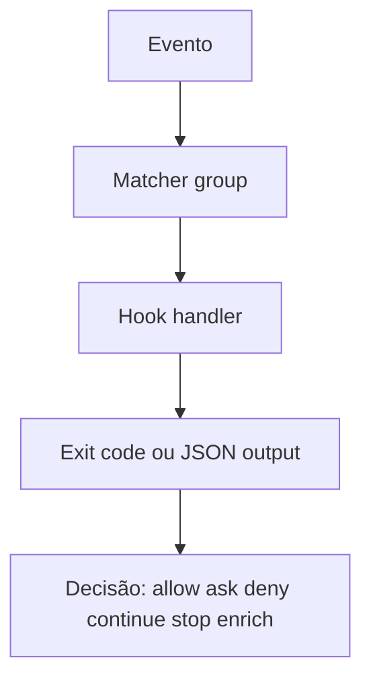

# Hooks

Hooks são o principal mecanismo de interceptação determinística do Claude Code. Eles conectam o runtime do agente a políticas, validações, observabilidade, notificações e automações obrigatórias.

Documentos relacionados:

- [Arquitetura central](../01-arquitetura-central/README.md)
- [Subagents](../05-subagents/README.md)
- [Skills, plugins e extensibilidade](../07-skills-e-plugins/README.md)

## 1. Definição

[Oficial] Hooks são handlers definidos pelo usuário que executam automaticamente em pontos específicos do ciclo de vida do Claude Code. Eles podem ser:

- `command`
- `http`
- `mcp_tool`
- `prompt`
- `agent`

O insight crítico é que hooks não são “instruções” para o modelo. São interceptores do runtime.

## 2. Papel arquitetural

Em uma stack agentic, hooks cumprem quatro papéis distintos:

1. enforcement: bloquear ou exigir comportamento
2. enrichment: inserir contexto ou feedback operacional
3. automation: disparar scripts, endpoints ou agentes
4. observability: auditar e notificar eventos do runtime

## 3. Ciclo de vida coberto

[Oficial] O ciclo de hooks cobre sessão, prompt, tool use, subagents, teams, compaction, config e eventos assíncronos.

### Taxonomia prática de eventos

| Família | Eventos relevantes |
| --- | --- |
| Sessão | `Setup`, `SessionStart`, `SessionEnd` |
| Prompt | `UserPromptSubmit`, `UserPromptExpansion`, `Stop`, `StopFailure` |
| Tooling | `PreToolUse`, `PostToolUse`, `PostToolUseFailure`, `PostToolBatch`, `PermissionRequest`, `PermissionDenied` |
| Delegação | `SubagentStart`, `SubagentStop`, `TaskCreated`, `TaskCompleted`, `TeammateIdle` |
| Estado assíncrono | `Notification`, `ConfigChange`, `InstructionsLoaded`, `CwdChanged`, `FileChanged` |
| Contexto | `PreCompact`, `PostCompact` |
| Worktree | `WorktreeCreate`, `WorktreeRemove` |
| MCP input | `Elicitation`, `ElicitationResult` |

## 4. Modelo de resolução

[Oficial] A resolução segue três camadas:

1. evento
2. matcher group
3. hook handler



## 5. Matcher e escopo

[Oficial] O matcher filtra o disparo conforme o tipo de evento:

- tool name para eventos de ferramenta
- agent type para `SubagentStart` e `SubagentStop`
- notification type
- reason de compaction ou encerramento
- filenames para `FileChanged`

Match de tools MCP segue o padrão `mcp__<server>__<tool>`.

## 6. Tipos de hooks

### 6.1 Command hooks

São o tipo mais comum. Executam scripts locais.

Use quando você precisa:

- validar comandos
- rodar lint ou formatação
- atualizar arquivos auxiliares
- emitir notificações

### 6.2 HTTP hooks

[Oficial] Enviam POST com JSON do evento para endpoint externo. São ideais para:

- auditoria centralizada
- policy engines remotos
- compliance as a service
- integração com gateways internos

Ponto importante: status HTTP não-2xx não bloqueia por si só. Para bloquear, o endpoint precisa devolver 2xx com JSON de decisão.

### 6.3 MCP tool hooks

[Oficial] Chamam tools de um servidor MCP já conectado. São úteis quando a validação obrigatória já vive em um servidor corporativo, e você quer reusar a mesma interface tool-based.

### 6.4 Prompt hooks

[Oficial] Executam avaliação single-turn por modelo rápido. São bons para decisões leves que pedem julgamento textual do modelo, mas não controle determinístico estrito.

### 6.5 Agent hooks

[Oficial, experimental] Disparam um subagent para verificar uma condição antes de decidir. São interessantes para validação rica em contexto, mas mais caros e lentos do que hooks determinísticos.

## 7. Síncrono versus assíncrono

[Oficial] Command hooks podem usar `async: true` para execução em background e `asyncRewake: true` para acordar Claude em falha específica.

### Use síncrono quando

- a decisão precisa bloquear a ação corrente
- o feedback precisa entrar imediatamente no turno
- o resultado precisa alterar input/output de tool use

### Use assíncrono quando

- você quer logging ou notificações sem segurar o agente
- o trabalho é lento e não altera a decisão atual
- o valor está em auditoria ou side effects, não em gating imediato

## 8. Entrada e saída

[Oficial] Hooks recebem JSON via stdin ou corpo HTTP. As respostas são controladas por:

- exit code
- stdout JSON estruturado
- stderr

### Códigos de saída importantes

| Código | Efeito |
| --- | --- |
| `0` | sucesso; JSON em stdout é processado |
| `2` | bloqueio forte para eventos que suportam block |
| outros | erro não bloqueante na maior parte dos eventos |

### Campo JSON de alto valor

- `continue`
- `stopReason`
- `systemMessage`
- `terminalSequence`
- `hookSpecificOutput`
- `additionalContext`

## 9. Padrões recomendados

### 9.1 Guardrails de comando

Use `PreToolUse` para negar comandos destrutivos, operações fora da política ou padrões de rede inseguros.

### 9.2 Lint e formatação pós-edição

Use `PostToolUse` em `Edit|Write` para rodar lint, formatter ou checks de schema.

### 9.3 Compliance e auditoria

HTTP hooks ou MCP tool hooks podem registrar:

- quem executou
- qual repo e cwd estavam ativos
- qual tool foi usada
- qual decisão foi tomada

### 9.4 Reatividade de ambiente

`CwdChanged` e `FileChanged` permitem integrar direnv, troca de credenciais, atualização de variáveis e reconfiguração de toolchain.

### 9.5 Notificações sem corromper terminal

[Oficial] Use `terminalSequence`, não escrita direta em `/dev/tty`.

## 10. Exemplos de uso valiosos

### Bloqueio de comando destrutivo

```json
{
	"hooks": {
		"PreToolUse": [
			{
				"matcher": "Bash",
				"hooks": [
					{
						"type": "command",
						"if": "Bash(rm *)",
						"command": "${CLAUDE_PROJECT_DIR}/.claude/hooks/block-rm.sh"
					}
				]
			}
		]
	}
}
```

### Lint obrigatório após escrita

```json
{
	"hooks": {
		"PostToolUse": [
			{
				"matcher": "Edit|Write",
				"hooks": [
					{
						"type": "command",
						"command": "${CLAUDE_PROJECT_DIR}/.claude/hooks/run-lint.sh",
						"args": []
					}
				]
			}
		]
	}
}
```

## 11. Hooks em skills, subagents e plugins

[Oficial] Hooks não vivem só em `settings.json`.

Eles também podem ser definidos em:

- frontmatter de skills
- frontmatter de subagents
- `hooks/hooks.json` de plugins

Isso muda o escopo de ativação:

- settings: globais por sessão/repositório/usuário
- skill: ativos durante a skill
- subagent: ativos durante a vida daquele worker
- plugin: ativos quando o plugin está habilitado

## 12. Riscos e anti-patterns

### 12.1 Usar hook para conhecimento, não enforcement

Se o objetivo é ensinar, prefira skill ou `CLAUDE.md`. Hook é melhor para interceptar e garantir.

### 12.2 Bloquear demais com handlers caros

Hooks `PreToolUse` lentos ou remotos demais degradam muito a experiência. O ideal é manter validações críticas pequenas, determinísticas e locais.

### 12.3 Confiar em `exit 1` para bloquear

[Oficial] O runtime usa `exit 2` como código de bloqueio. `exit 1` é, em geral, erro não bloqueante.

### 12.4 Matchers excessivamente amplos

Um matcher `Bash` com script pesado e sem `if` fino pode virar gargalo em toda a sessão.

### 12.5 Usar prompt hook para política dura

Prompt hooks são úteis para julgamento, não para garantias fortes. Política dura deve ficar em command hook, HTTP hook com retorno formal ou permission rules.

## 13. Limitações importantes

- [Oficial] agent hooks são experimentais
- [Oficial] hooks `SessionStart` e `Setup` podem disparar antes de MCP estar pronto
- [Oficial] hooks não possuem forma nativa de desativação individual sem remover configuração; `disableAllHooks` atua globalmente
- [Oficial] plugin hooks podem ser bloqueados por `allowManagedHooksOnly`, exceto casos explicitamente forçados em managed settings

## 14. Recomendação prática

Use hooks para tudo que precisa ser verdadeiro sempre, especialmente:

- segurança
- compliance
- validação pós-edição
- notificação operacional
- higienização de inputs e outputs

Se a regra é mandatória, ela não deve ficar só no prompt.