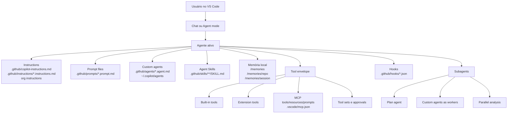

# GitHub Copilot local no VS Code: agents, subagents e customização avançada

Este dossiê consolida um recorte específico e pragmático: como projetar, configurar, governar e evoluir agents localmente no VS Code com GitHub Copilot.

O foco principal é o uso local no editor e no workspace. Recursos cloud, GitHub.com e superfícies remotas aparecem apenas quando ajudam a explicar limites, precedência, políticas ou contrastes de arquitetura.

Snapshot de pesquisa: 2026-05-19.

## 1. Snapshot de evidências

| Corpus | Contagem real atingida | Observação |
| --- | --- | --- |
| Documentação técnica oficial | 270 fontes utilizáveis | derivadas de 546 arquivos candidatos nos repositórios oficiais `microsoft/vscode-docs` e `github/docs`; 90 diretamente sobre customização local e 180 contextuais relevantes |
| Medium com data verificável `>= 2026-04-01` | 75 posts | 37 diretos e 38 adjacentes; 0 datas não verificadas na coleta reproduzível |
| Artefatos comunitários observados | 60 padrões analisados em detalhe | extraídos de pelo menos 230 artefatos `repo/path` visíveis nas primeiras páginas de 9 consultas públicas ao GitHub code search; soma bruta das consultas: 73.743 matches |
| Fóruns e discussões `>= 2026-04-01` | 30 fontes | 17 threads do Hacker News, 10 GitHub Issues e 3 perguntas do Stack Overflow |
| Sites especialistas e análises recentes | 20 fontes | 5 com data de página verificável e 15 ancoradas pela data verificável da thread pública recente que as circulou |

Convenção de evidência usada neste módulo:

- `Verificado`: explicitamente sustentado pela documentação oficial, pelo manifesto gerado ou pela existência observável do artefato no repositório público.
- `Inferência`: conclusão arquitetural derivada de várias fontes, mas não expressa como contrato do produto.
- `Hipótese`: possibilidade plausível não suficientemente fechada pelas fontes; não vira recomendação forte.

## 2. Resumo executivo

1. O centro de gravidade do setup local no VS Code deixou de ser um único prompt global. A arquitetura madura usa camadas diferentes para política persistente, tarefas reutilizáveis, especialização de agentes, integração externa, guardrails e memória.
2. O formato atual de especialização local no VS Code é `*.agent.md` em `.github/agents` ou em `~/.copilot/agents`. O parque comunitário ainda mostra muito `*.chatmode.md`, mas a orientação oficial atual é migrar esses arquivos para `.agent.md`.
3. `copilot-instructions.md` e `*.instructions.md` resolvem problemas diferentes. O primeiro é baseline de projeto; o segundo é roteamento contextual por arquivo, stack ou tarefa.
4. Prompt files são a melhor unidade para automação reutilizável sem criar uma persona persistente. Quando a tarefa exige restrição de ferramentas, handoff ou modelo específico, custom agent tende a ser a unidade correta.
5. Skills não substituem instruções nem prompts. Elas empacotam capacidade portável com instruções, scripts e recursos, e funcionam melhor quando o workflow precisa ser reutilizado em vários agentes e superfícies compatíveis.
6. Subagents são a primitive nativa de isolamento de contexto no VS Code. Eles reduzem ruído, permitem fan-out paralelo e podem usar agentes customizados como workers especializados.
7. Hooks e permissões são o principal envelope de governança local. Instrução orienta comportamento; hook executa automação determinística; aprovação controla blast radius real.
8. MCP é a fronteira de integração mais poderosa e também a de maior risco. O ganho vem de ferramentas, prompts e recursos externos; o risco vem de confiança excessiva, escopo amplo e aprovações relaxadas.
9. Memória não é sinônimo de instruções. Ela é um mecanismo local de persistência em arquivos de escopo `user`, `repo` e `session`, útil para continuidade operacional e não para política compartilhada versionada.
10. O padrão mais sustentável para times é: baseline de instruções enxuto, prompt files para tarefas, agentes especializados por papel, subagents para isolamento, hooks só onde houver regra determinística, MCP mínimo e memória governada.

## 3. Arquitetura local de customização

Leitura arquitetural:

- política persistente mora em instructions, não em prompt files
- workflow reutilizável sob demanda mora em prompt files
- persona especializada com ferramentas e modelo próprios mora em custom agents
- capacidade portável cross-agent mora em skills
- enforcement e automação determinística moram em hooks
- acesso externo vive em MCP e extension tools
- isolamento lateral de contexto vive em subagents
- continuidade entre sessões vive em memória

## 4. Diferenciação dos mecanismos

| Mecanismo | Superfície principal | Quando usar | Quando não usar | Controle de ferramentas/modelo | Estado |
| --- | --- | --- | --- | --- | --- |
| Custom agents | `.github/agents/*.agent.md`, `~/.copilot/agents`, org, extensão | persona persistente, handoff, especialização por papel, tool restrictions, modelo preferido | tarefa pontual simples ou guideline global do repositório | forte: `tools`, `model`, instruções do agente, uso como subagent | `Verificado` |
| Subagents | runtime via `runSubagent` ou `agent` tool | pesquisa isolada, análise paralela, múltiplas perspectivas, limpeza de contexto | tarefa curta, conversa altamente interativa, edição concorrente sem coordenação | herdam defaults, mas podem usar custom agents para sobrescrever modelo e tools | `Verificado` |
| Plan agent / plan mode | `/plan`, seletor de agente, `plan.md` em memória de sessão | detalhar plano antes de codificar, revisar etapas e verificação | executar ação imediata trivial, hotfix muito pequeno | moderado: agente dedicado ao planejamento; persiste plano em `/memories/session/plan.md` | `Verificado` |
| Implementer / implement agent | normalmente um custom agent de implementação | executar código após pesquisa/plano aprovados | como se fosse primitive oficial separada quando não há documentação explícita | forte quando modelado como custom agent; costuma combinar `edit`, terminal e leitura de última execução | `Inferência forte` |
| Prompt files | `.github/prompts/*.prompt.md` | tarefas reutilizáveis sob demanda, onboarding operacional, review, geração de testes, sync | baseline permanente de regras ou persona persistente | moderado: frontmatter pode pinçar `model` e `tools` na execução | `Verificado` |
| `copilot-instructions.md` | `.github/copilot-instructions.md` | padrão global do repositório, estilo, convenções, guardrails editoriais | casos por stack ou arquivo específico | baixo: orienta resposta, não é envelope de tool policy | `Verificado` |
| `*.instructions.md` | `.github/instructions/*.instructions.md`, `~/.copilot/instructions` | regras condicionais por stack, área, framework ou tarefa via `applyTo` | substituir prompt files ou agents quando a necessidade é execução e não guideline | baixo: contexto adicional, não rota ferramentas | `Verificado` |
| Agent Skills | `.github/skills/**/SKILL.md`, `.claude/skills`, `.agents/skills` | capacidades reutilizáveis com scripts, exemplos e recursos; portabilidade entre agentes compatíveis | guideline simples de projeto ou tarefa descartável | indireto: skill descreve capacidade; execução depende de tools disponíveis | `Verificado` |
| Hooks | `.github/hooks/*.json`, `~/.copilot/hooks`, `.claude/settings.json` | validação determinística, pós-edição, segurança, setup de sessão, automação de lifecycle | expressar apenas estilo, intenção ou heurística vaga | alto por automação; não seleciona modelo, mas influencia execução real | `Verificado`, `Preview` |
| MCP servers | `.vscode/mcp.json`, `mcp.json` do perfil | integrar APIs, browser, bancos, catálogos, prompts e recursos externos | expor integração ampla sem trust model claro | muito alto: adiciona tools, resources, prompts e apps | `Verificado` |
| Tool sets e approvals | picker de tools, `Chat: Manage Tool Approval`, níveis de permissão | ajustar autonomia por sessão, pré-aprovação, pós-aprovação, blast radius | substituir modelagem de agentes ou política de repositório | muito alto: é o envelope de autonomia efetiva | `Verificado` |
| Memória | `/memories/`, `/memories/repo/`, `/memories/session/` | preferências, fatos do repositório, planos de sessão, continuidade local | substituir artefato versionado do projeto | indireto: persiste contexto; não define tools | `Verificado` |
| `AGENTS.md` | arquivo no workspace citado pelas docs de instructions | contexto para múltiplos agentes e ecossistemas mistos | assumir que substitui todos os mecanismos do Copilot | baixo: arquivo de contexto, não runtime surface dedicada | `Verificado` como prática suportada; `Inferência` sobre amplitude |

Notas importantes:

- A documentação oficial atual do VS Code trata `*.agent.md` como o formato atual para agentes customizados e explicita a migração de `*.chatmode.md` para `.agent.md`.
- Na comunidade, `chatmodes` ainda aparecem em volume relevante. Eles são úteis como evidência histórica e operacional, mas não devem ser tratados como formato-alvo para um setup novo.
- O corpus oficial coletado não mostrou um “Implement agent” embutido como primitive separada comparável ao Plan agent. Na prática, `implementer` aparece como papel recorrente em exemplos e setups comunitários.

## 5. Descoberta, escopos e precedência local

### 5.1 Custom agents

- workspace: `.github/agents`
- user profile: `~/.copilot/agents` ou storage do perfil do VS Code
- adicionais: `setting(chat.agentFilesLocations)`
- outras origens oficiais: built-in, organization-defined e extension-contributed agents

### 5.2 Instructions

- baseline do workspace: `.github/copilot-instructions.md`
- instructions condicionais: `.github/instructions/*.instructions.md`
- user profile: `~/.copilot/instructions`, `~/.claude/rules` ou storage do perfil
- adicionais: `setting(chat.instructionsFilesLocations)`
- camada extra corporativa: organization custom instructions no GitHub

### 5.3 Prompt files

- workspace: `.github/prompts/*.prompt.md`
- user profile: storage do perfil do VS Code
- adicionais: `setting(chat.promptFilesLocations)`

### 5.4 Skills

- project skills: `.github/skills/`, `.claude/skills/`, `.agents/skills/`
- personal skills: `~/.copilot/skills/`, `~/.claude/skills/`, `~/.agents/skills/`
- adicionais: `setting(chat.agentSkillsLocations)`

### 5.5 Hooks

- workspace: `.github/hooks/*.json`
- compatibilidade adicional: `.claude/settings.json`, `.claude/settings.local.json`
- user: `~/.copilot/hooks`, `~/.claude/settings.json`
- adicionais: `setting(chat.hookFilesLocations)`

### 5.6 MCP

- workspace: `.vscode/mcp.json`
- user profile: `mcp.json` do perfil aberto via `MCP: Open User Configuration`
- comandos úteis: `Chat: Open Customizations`, `MCP: Open Workspace Folder MCP Configuration`, `MCP: Browse Resources`

### 5.7 Memory

- user: `/memories/`
- repository: `/memories/repo/`
- session: `/memories/session/`
- o Plan agent persiste `plan.md` em memória de sessão

Leitura de precedência e operação:

- use repositório para padrões compartilhados do time
- use perfil para preferências pessoais e kits reutilizáveis entre workspaces
- use organização para política corporativa transversal
- use extensão apenas quando o time precisa empacotar e distribuir capacidade

## 6. Combinações que realmente funcionam em fluxos locais

### 6.1 Baseline saudável de equipe

- `.github/copilot-instructions.md` curto para regras universais
- `.github/instructions/*.instructions.md` por stack ou diretório crítico
- `.github/prompts/` para tarefas recorrentes do time

Quando isso funciona:

- repositório com convenções estáveis
- múltiplos contribuidores usando Copilot no VS Code
- necessidade de ganho rápido sem abrir grande superfície de automação

### 6.2 Planejar antes de editar

- Plan agent para gerar e revisar plano
- subagents para fan-out de pesquisa isolada
- custom `implementer.agent.md` para executar depois do plano aprovado

Quando isso funciona:

- refactor médio ou grande
- mudanças multiarquivo
- código legado com muito contexto implícito

### 6.3 Especialistas com blast radius pequeno

- `researcher.agent.md` read-only
- `reviewer.agent.md` sem ferramentas destrutivas
- `implementer.agent.md` com edição e terminal, mas sem web por default

Quando isso funciona:

- times que querem autonomia sem abrir tudo para o agente principal
- cenários com auditoria local e aprovação humana frequente

### 6.4 Skill + MCP + hook

- skill fornece workflow e semântica
- MCP executa integração externa
- hook valida ou bloqueia etapa crítica

Quando isso funciona:

- publish, deploy, triagem de incidentes, debug de CI, auditoria de dependências

### 6.5 Tool sets e aprovações por sessão

- picker de tools reduz a superfície em cada sessão
- `Default Approvals`, `Bypass Approvals` e `Autopilot` ajustam envelope operacional
- `Chat: Manage Tool Approval` centraliza trust por fonte e ferramenta

Quando isso funciona:

- workspaces com várias extensões e MCP servers
- sessões temporárias de debugging ou review em que o conjunto de tools deve ser menor do que o máximo disponível

## 7. Como desenhar agents especializados no VS Code

| Papel | Objetivo primário | Ferramentas recomendadas | Postura de modelo | Delegação | Risco principal |
| --- | --- | --- | --- | --- | --- |
| Planner | decompor trabalho, mapear riscos, produzir plano | busca no codebase, usos, web/fetch opcional, `runSubagent` | modelo de raciocínio mais forte | sim, para pesquisa lateral | virar agente de execução sem aprovação humana |
| Researcher | explorar padrões, docs, regressões e opções | busca, usages, web/fetch, leitura; sem edição | rápido ou equilibrado | não necessariamente | contaminar contexto com achados pouco filtrados |
| Implementer | alterar código de forma controlada | edição, leitura, terminal/last command, testes locais | equilibrado com bom tool calling | só se houver subtarefa lateral | editar cedo demais sem plano estável |
| Reviewer | revisar mudança, risco, segurança, testes | leitura, diff, buscas, terminal de validação; sem edição por default | equilibrado | raramente | virar “rubber stamp” com contexto insuficiente |
| Debugger | reproduzir falhas e reduzir hipóteses | terminal, logs, busca, leitura de teste | raciocínio médio/alto | sim para análises paralelas | executar comandos demais sem controle de aprovação |
| Automation operator | rodar workflows e integrações | MCP, tool sets, hooks, terminal controlado | equilibrado | não | blast radius alto em sistemas externos |
| Discovery técnico | mapear superfícies desconhecidas | web/fetch, search/codebase, search/usages | rápido | sim | custo alto com pesquisa aberta demais |

Heurística prática:

- se o papel precisa editar, separe-o do papel que aprova ou revisa
- se o papel precisa web ou MCP, não o use como baseline para toda sessão
- se o papel precisa contexto longo, use memória de sessão ou plano, não `copilot-instructions.md`

## 8. Configurações avançadas que valem a pena

### 8.1 Modelos

`Verificado`

- o seletor de modelo no chat controla o modelo da conversa e da edição
- custom agents e prompt files podem influenciar a escolha de modelo
- a lista de modelos em agent mode é menor e filtrada por suporte a tool calling
- modelos premium expõem multiplicador de premium requests; isso muda custo real
- modelos com `thinking effort` maior fazem sentido em arquitetura, refactor e debugging multietapa

Recomendação:

- planner e reviewer: modelo de raciocínio mais forte
- implementer e debugger: modelo equilibrado com bom tool calling
- researcher: modelo rápido quando a análise for barata e paralelizável

### 8.2 Tools, tool sets e permissões

`Verificado`

- o VS Code distingue built-in tools, MCP tools e extension tools
- tool sets são agrupamentos convenientes visíveis via `#` e no picker de tools
- permissões por sessão ficam no dropdown de autonomia
- `Autopilot` e `Bypass Approvals` pulam prompts manuais e são superfícies de risco elevadas
- `Chat: Manage Tool Approval` permite pré-aprovação e pós-aprovação por tool ou por fonte

Recomendação:

- use `Default Approvals` como baseline de time
- reserve `Bypass` e `Autopilot` para agentes pequenos, controlados e com tools mínimas
- prefira reduzir o conjunto de tools disponível a confiar só no prompt

### 8.3 Hooks

`Verificado`, `Preview`

- hooks recebem JSON estruturado e podem devolver JSON para influenciar o comportamento do agente
- funcionam com agentes locais, background e cloud
- existem eventos de lifecycle como `SessionStart`
- o formato e o comportamento ainda podem mudar
- organizações podem desabilitar hooks

Recomendação:

- use hooks para validações determinísticas: formatar, bloquear segredos, validar estado do repo, registrar sessão
- não use hooks para lógica lenta, instável ou que dependa de rede frágil sem fallback claro

### 8.4 MCP

`Verificado`

- MCP adiciona tools, resources, prompts e apps interativas
- `.vscode/mcp.json` é compartilhável no repositório
- `inputs` permitem capturar variáveis sensíveis sem fixá-las no arquivo
- a confiança na ferramenta é pedida quando o servidor é iniciado
- o picker `Configure Tools` permite ligar e desligar tools específicas de um servidor

Recomendação:

- um servidor por necessidade clara
- versionar apenas o que o time inteiro deve reutilizar
- usar `inputs` e evitar segredos hardcoded em `env`
- revisar aprovações por source, não só por tool individual

### 8.5 Memória

`Verificado`

- toda a memória fica local na máquina
- user memory persiste entre workspaces; repo memory persiste só naquele workspace; session memory morre com o chat
- o Plan agent escreve `plan.md` em memória de sessão

Recomendação:

- preferências pessoais e comandos favoritos: user memory
- fatos do repositório e convenções: repository memory
- plano de trabalho e notas temporárias: session memory
- não confundir memória com documentação versionada do time

## 9. Anti-padrões recorrentes

1. Colocar tudo em `copilot-instructions.md` e esperar que isso substitua prompts, agents, hooks e skills.
2. Criar um único agent “faz tudo” com web, MCP, edição, terminal e permissões relaxadas.
3. Tratar `Bypass Approvals` ou `Autopilot` como baseline.
4. Versionar `.chatmode.md` novo em vez de migrar para `.agent.md`.
5. Versionar `mcp.json` com segredos, `env` sensível ou blast radius desnecessário.
6. Transformar hooks em mini-plataforma opaca e lenta, acoplada a rede externa.
7. Usar prompt files para política persistente ou instruções para workflow procedural complexo.
8. Misturar memória local com artefato compartilhado do repositório sem governança.
9. Fazer subagent editar os mesmos arquivos do agente principal sem desenho claro de ownership.
10. Tratar popularidade comunitária como substituto de contrato oficial.

## 10. Convergências e divergências entre oficial e comunidade

Convergências fortes:

- `.github/` como pacote operacional versionado do workspace
- decomposição por papel: planner, reviewer, implementer, debugger
- uso de prompt files para tarefas recorrentes
- uso de MCP como extensão de capacidades, não como substituto de instruções
- hooks para guardrails determinísticos

Divergências relevantes:

- a comunidade ainda carrega muito `chatmodes`, enquanto a documentação atual enfatiza `.agent.md`
- há muitos repositórios com `mcp.json.sample`, `backup` e convenções próprias; isso é útil como laboratório, mas fraco como padrão corporativo
- AGENTS.md aparece como peça de contexto multiagente em parte da comunidade, enquanto o stack oficial do VS Code concentra a maior parte da customização em `.github/`, perfil e settings

## 11. Nível de confiança e lacunas

- `Alta confiança`: instruções, prompt files, custom agents, subagents, skills, hooks, MCP, memory, tool approvals, plan agent e caminhos padrão documentados
- `Confiança média`: convergências comunitárias em torno de papéis como `planner`, `reviewer`, `debugger` e `implementer`
- `Risco de fonte única`: ausência de página oficial específica para um “Implement agent” embutido; a recomendação aqui trata `implementer` como pattern de custom agent, não como primitive oficial autônoma
- `Lacuna operacional`: parte do ecossistema ainda está em transição de `chatmodes` para `agents`; setups públicos podem misturar formatos antigos e novos

## 12. Próximos documentos deste módulo

- [Fontes e metodologia](./fontes-e-metodologia.md)
- [60 padrões comunitários analisados](./padroes-comunitarios.md)
- [Sinais avançados desde 2026-04-01](./sinais-avancados-desde-2026-04-01.md)
- [Custom agents: leitura avançada desde 2026-04-01](./custom-agents-avancados-desde-2026-04-01.md)
- [Handoffs: leitura avançada desde 2026-04-01](./handoffs-avancados-desde-2026-04-01.md)
- [Playbook operacional reutilizável](./playbook-operacional.md)
- [Topologia de runtime e pastas](./topologia-de-runtime-e-pastas.md)
- [Fleet de agents e handoffs](./fleet-de-agents-e-handoffs.md)
