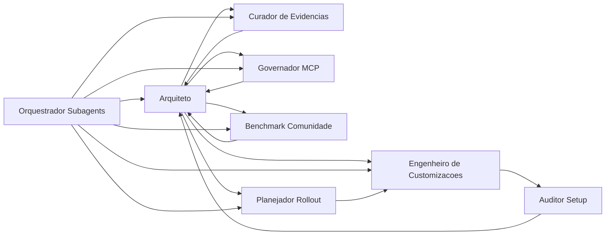

# Fleet de agents e handoffs

Este documento descreve a fleet local de agents especializados do repositório e como ela deve ser usada com o pacote de skills e com o prompt de evolução do catálogo.

## 1. O que está verificado no repositório

Facts observáveis no workspace atual:

1. Existem 8 agents especializados em `.github/agents/*.agent.md`.
2. Apenas `copilot-vscode-orquestrador-subagents` expõe a tool `agent` no frontmatter, então ele é o pivot natural de delegação entre especialistas.
3. Apenas `copilot-vscode-engenheiro-customizacoes` expõe `edit`, então ele é o único agent explicitamente voltado a materializar customizações.
4. Os agents de arquitetura, auditoria e governança estão com envelope read-only (`read`, `search`) ou quase read-only.
5. Os agents de evidência e benchmark comunitário usam web além de leitura e busca, coerente com o papel de pesquisa externa.
6. O prompt [evolve-skills.prompt.md](../../.github/prompts/evolve-skills.prompt.md) já referencia explicitamente essa fleet como especialistas preferenciais.

## 2. Fleet atual

| Agent | Missão principal | Tools verificadas | Quando deve liderar | Handoff recomendado |
| --- | --- | --- | --- | --- |
| `copilot-vscode-arquiteto-configuracoes` | decidir a superfície correta e o desenho local | `read`, `search` | problema arquitetural ou dúvida entre mecanismos | para evidência, governança, builder ou rollout |
| `copilot-vscode-curador-evidencias` | fechar contagens, conflitos de fonte e nível de confiança | `read`, `search`, `web` | pergunta que precisa base auditável | de volta ao arquiteto ou ao auditor |
| `copilot-vscode-engenheiro-customizacoes` | criar ou ajustar artefatos de customização | `read`, `search`, `edit` | depois que o desenho já está claro | para auditor ou reviewer humano |
| `copilot-vscode-orquestrador-subagents` | dividir trabalho e limpar contexto | `read`, `search`, `agent`, `todo` | tarefas multiagente e multiestágio | para qualquer especialista apropriado |
| `copilot-vscode-governador-mcp` | revisar MCP, approvals, segredos e blast radius | `read`, `search` | quando houver `.vscode/mcp.json`, integrations e approvals | para arquiteto ou builder |
| `copilot-vscode-auditor-setup` | detectar overlap, naming ruim, excesso de tools e risco | `read`, `search` | review de setup existente | para arquiteto ou builder |
| `copilot-vscode-benchmark-comunidade` | comparar com padrões públicos maduros ou frágeis | `read`, `search`, `web` | benchmarking e justificativa comunitária | para arquiteto ou rollout |
| `copilot-vscode-planejador-rollout` | transformar arquitetura em adoção, ownership e fases | `read`, `search`, `todo` | rollout de time, maturidade e governança operacional | para builder ou auditor |

## 3. Grafo de handoffs recomendado

Leitura do grafo:

- o orquestrador é o agent mais adequado para fan-out
- o arquiteto continua sendo o melhor ponto de reconciliação de recomendações conflitantes
- o engenheiro entra tarde, depois que arquitetura e evidência já estão minimamente fechadas
- o auditor fecha o loop quando o problema é consistência, risco ou regressão estrutural

## 4. Contratos de saída por papel

### 4.1 Arquiteto

Deve devolver:

- problema arquitetural
- 2 ou 3 superfícies candidatas no máximo
- escolha principal
- o que explicitamente não usar
- riscos e tradeoffs

### 4.2 Curador de evidências

Deve devolver:

- contagens reais
- fonte principal para cada claim forte
- conflitos entre oficial e comunidade
- nível de confiança

### 4.3 Engenheiro de customizações

Deve devolver:

- superfície escolhida
- arquivos criados ou alterados
- justificativa curta
- validação recomendada

### 4.4 Orquestrador de subagents

Deve devolver:

- sequência de handoffs
- papéis envolvidos
- tools e modelos por papel
- limites operacionais e ownership

### 4.5 Governador MCP

Deve devolver:

- decisão sobre config compartilhado vs pessoal
- risco de segredos e approvals
- blast radius por tool source
- rollback simples

### 4.6 Auditor de setup

Deve devolver:

- findings por severidade
- overlaps e anti-padrões
- correção mínima por finding
- lacunas de validação

### 4.7 Benchmark comunidade

Deve devolver:

- paralelo comunitário relevante
- sinal maduro, emergente ou frágil
- convergência ou divergência com o guidance oficial

### 4.8 Planejador de rollout

Deve devolver:

- fase atual
- fase alvo
- artefatos mínimos
- ownership
- critérios de promoção e rollback

## 5. Quando não fazer handoff

Evite handoff quando:

1. a tarefa cabe inteira em um único agent read-only
2. a decisão principal ainda não está clara o bastante para separar subtarefas
3. dois workers cairiam nos mesmos arquivos sem ownership explícito
4. o ganho de paralelismo é menor do que o custo de reconciliação

## 6. Relação com skills e prompt de manutenção

O prompt [evolve-skills.prompt.md](../../.github/prompts/evolve-skills.prompt.md) funciona como entrypoint de manutenção avançada do catálogo.

A relação correta é:

- prompt file aciona o workflow sob demanda
- agents executam papéis especializados com tool surface controlada
- skills encapsulam conhecimento reutilizável e materiais de apoio
- dossiê em `docs/13-github-copilot-vscode-local/` continua sendo a camada canônica de arquitetura e evidência

## 7. Risco principal desta fleet

O maior risco não é “faltar agent”. O maior risco é usar agents demais para decisões que ainda não foram estreitadas.

Heurística prática:

- 1 agent quando a pergunta é local e clara
- 2 agents quando existe uma dúvida real entre arquitetura e evidência ou entre arquitetura e governança
- 3 agents só quando o orquestrador estiver reconcilhando trilhas independentes

## 8. Nível de confiança

- `Alta confiança`: composição de papéis, envelopes de tools observados, papel central do orquestrador, papel tardio do engenheiro
- `Confiança média-alta`: grafo de handoff recomendado, porque ele é derivado da arquitetura dos arquivos e não explicitamente codificado como workflow executável único
